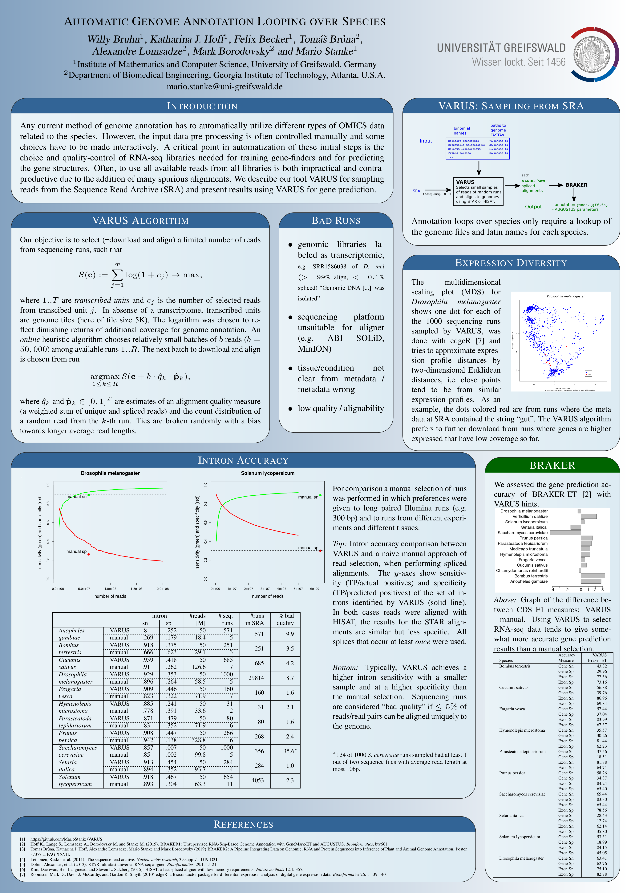

# VARUS: Drawing Diverse Samples from RNA-Seq Libraries
**VARUS** was originally written by Willy Bruhn as a Bachelors' thesis supervised by Mario Stanke. This repository is a copy of https://github.com/WillyBruhn/VARUS made in November 2018 and contains many bigfixes, an incremental intron database feature and an extension for using HISAT.

**VARUS** automates the selection and download of a limited number of RNA-seq reads from at NCBI's Sequence Read Archive (SRA) targeting a **sufficiently** high coverage for many genes.
Each iteration of the online algorithm

- selects a run to download, that is expected to complement previously downloaded reads
- downloads a sample of reads ("batch") from the run with **fastq-dump**
- aligns the reads with **STAR** or **HISAT**
- evaluates the alignment


# INSTALLATION
## LINUX
Invoke the following command from the command-line in order to clone the repository: 
```sh
git clone https://github.com/MarioStanke/VARUS.git
```

**VARUS** depends on
- samtools, 
- [fastq-dump](https://ncbi.github.io/sra-tools/fastq-dump.html) and 
- [STAR](https://github.com/alexdobin/STAR) or [HISAT](https://ccb.jhu.edu/software/hisat) (tested with HISAT 1, version 0.1.6-beta) and
- requires the script [filterIntronsFindStrand.pl](https://github.com/Gaius-Augustus/BRAKER/blob/master/scripts/filterIntronsFindStrand.pl) to be in the executable path.

Compile **VARUS** manually with
```
cd Implementation
make
``` 

### Disable NCBI Cache
By default the NCBI tool `fastq-dump` creates temporary files under `~/ncbi` of the same size as the run file from which data is downloaded, even if only a small part thereof is downloaded. Disable this caching behavior that requires probably too much hard drive space for most users with
```
mkdir -p ~/.ncbi
echo '/repository/user/cache-disabled = "true"' >> ~/.ncbi/user-settings.mkfg
```

# Getting Started

## Example
Change to directory `example` and follow the instructions in example/README.

## Running VARUS
Copy the file `VARUSparameters.txt` from the example folder to your working directory and adjust it if necessary:

Pay attention to the following parameters:

**--pathToSTAR** must point to the executable of **STAR**. <!-- make this consistent over aligners -->

**--maxBatches** specifies how many runs you want to download at most.

**--batchSize** specifies how many reads you want to download in each step.

The final output is a sorted spliced alignment file (all batches together) called ***VARUS.bam***.

# VARUS at PAG2019


# Bachelor Thesis
Find the bachelor thesis of Willy Bruhn corresponding to **VARUS** in /docs/Thesis.
