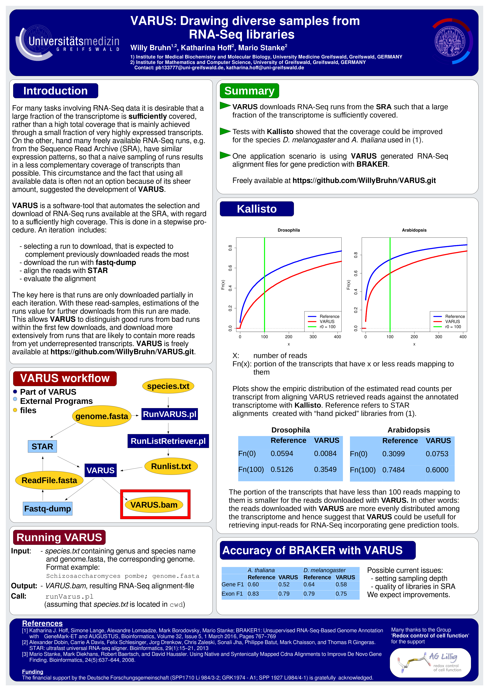

# VARUS: Drawing diverse samples from RNA-Seq libraries
**VARUS** was written by Willy Bruhn. This repository is a copy of https://github.com/WillyBruhn/VARUS made in November 2018.
**VARUS** automates the selection and download of RNA-Seq runs available at the SRA, with regard to a **sufficiently** high coverage. This is done in a stepwise procedure. An iteration includes:

- selecting a run to download, that is expected to complement previously downloaded reads the most
- download the run with **fastq-dump**
- align the reads with **STAR**
- evaluate the alignment

The key here is that runs are only downloaded partially in each iteration. With these read-samples, estimations of the runs value for further downloads from this run are made. This allows **VARUS** to distinguish good runs from bad runs within the first few downloads, and download more extensively from runs that are likely to contain more reads from yet underrepresented transcripts.

# INSTALLATION
## LINUX
Invoke the following command from the command-line in order to clone the repository: 
```sh
git clone https://github.com/WillyBruhn/VARUS.git
```

**VARUS** incorporates the tools 
fastq-dump [https://ncbi.github.io/sra-tools/fastq-dump.html] 
and 
STAR [https://github.com/alexdobin/STAR]. 
You can install both tools and compile VARUS by invoking:
```sh
VARUS/./install.sh
``` 
If you choose to install fastq-dump and STAR manually don't forget to also compile **VARUS** manually by invoking:
```sh
cd Implementation

make
``` 

### Disable NCBI Cache
By default the NCBI tool `fastq-dump` creates temporary a file under ~/ncbi of the same size as the run file from which data is downloaded, even if only a small part thereof is downloaded. Disable this caching behavior with
```
mkdir -p ~/.ncbi
echo '/repository/user/cache-disabled = "true"' >> ~/.ncbi/user-settings.mkfg
```

# Getting Started
## Downloading Runs
Find a working setup under /GettingStarted/Pombe. Change to this folder and invoke the following command to start downloading runs:
```sh
../.././runVARUS.pl
```
The final output is a file called ***VARUS.bam***.

You can use this for your applications by modifying ***VARUSparameters.txt*** 
and ***species.txt*** and substituting ***pombe.fasta*** with a corresponding genome-file. 

### VARUSparameters.txt
Pay attention to the following parameters:

**--pathToSTAR** must point to the executable of **STAR**.

**--maxBatches** specifies how many runs you want to download at most.

**--batchSize** specifies how many reads you want to download in each step.


# VARUS at PAG2018


# Bachelor Thesis
Find the bachelor thesis of Willy Bruhn corresponding to **VARUS** in /docs/Thesis.

